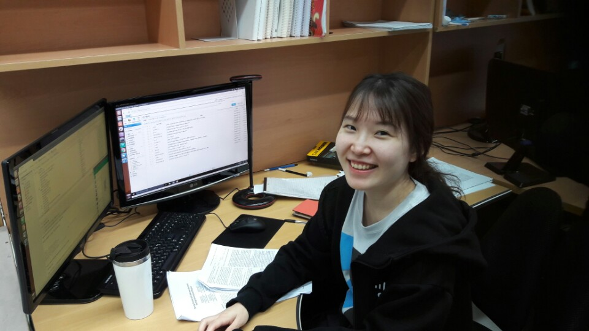

---
# Feel free to add content and custom Front Matter to this file.
# To modify the layout, see https://jekyllrb.com/docs/themes/#overriding-theme-defaults

layout: default
title: Jiin Woo
permalink: /
---

*{{ site.email }}* \\
Data Insight Center, [NAVER Corporation](https://www.navercorp.com/en/), Seongnam, South Korea.

<a href="https://github.com/{{ site.github_username }}"><i class="fab fa-github fa-2x"></i></a>
<a href="https://scholar.google.co.kr/citations?user=fwDL_gMAAAAJ"><i class="ai ai-google-scholar fa-2x"></i></a>

Hi, I am a machine learning engineer in NAVER Corporation.  I received an M.S. in Electrical Engineering (Aug. 2018) and a B.S. in Mathematical Sciences (Aug. 2016) in Korea Advanced Institute of Science and Technology (KAIST). \\
[CV](images/CV_jiwoo1.pdf)

---

#### Work Experience
<strong>NAVER Corporation</strong>, Seongnam, Korea, 2018. 09 - present \\
<strong>Machine Learning Engineer</strong>

---

#### Publications
(C: Conference, J: Journal)

[C3] Iterative Learning of Graph Connectivity from Partially‑Observed Cascade Samples \\
<strong><u>Jiin Woo</u></strong>, Jungseul Ok, Yung Yi \\
*ACM MobiHoc*, 2020 \\
[[paper](images/full_ver.pdf)]

[J2]  Information Source Finding in Networks: Querying With Budgets \\
Jaeyoung Choi, Sangwoo Moon, <strong><u>Jiin Woo</u></strong>, KyungHwan Son, Jinwoo Shin, Yung Yi \\
*IEEE/ACM Transactions on Networking*, 2020 \\
[[paper](https://arxiv.org/pdf/2009.00795.pdf)]

[C2]  On the Asymptotic Content Routing Stretch in Network of Caches: Impact of Popularity Learning \\
Boram Jin, <strong><u>Jiin Woo</u></strong>, Yung Yi \\
*NETGCOOP*, 2019 \\
[[paper](http://lanada.kaist.ac.kr/Publication/Conference/On_the_asymptotic.pdf)]

[J1] Estimating the Information Source under Decaying Diffusion Rates \\
<strong><u>Jiin Woo</u></strong>, Jaeyoung Choi \\
*Electronics*, 2019 \\
[[paper](https://www.mdpi.com/2079-9292/8/12/1384)]

[C1]  Rumor Source Detection under Querying with Untruthful Answers \\
Jaeyoung Choi, Sangwoo Moon, <strong><u>Jiin Woo</u></strong>, KyungHwan Son, Jinwoo Shin, Yung Yi \\
*IEEE INFOCOM*, 2017 \\
[[paper](https://arxiv.org/pdf/1711.05496.pdf)]

---

#### Education
<strong>Korea Advanced Institute of Science and Technology (KAIST)</strong>, Daejeon, Korea, 2016. 08 - 2018. 08 \\
<strong>M.S. in Electrical Engineering</strong> (advisor: [Yung Yi](http://lanada.kaist.ac.kr/~yi/))

<strong>Korea Advanced Institute of Science and Technology (KAIST)</strong>, Daejeon, Korea, 2011. 02 - 2016. 08 \\
<strong>B.S. in Mathematical Sciences</strong>

---

#### Awards & Scholarships
- KAIST Support Scholarship (2016-2018)
- Excellence Award in Creative Challenge Type SW R&D Program (2015)
- 3rd place in “Show Me The Street” Innovation Challenge (2015)
- The National Scholarship for Science and Engineering (2011-2015)
