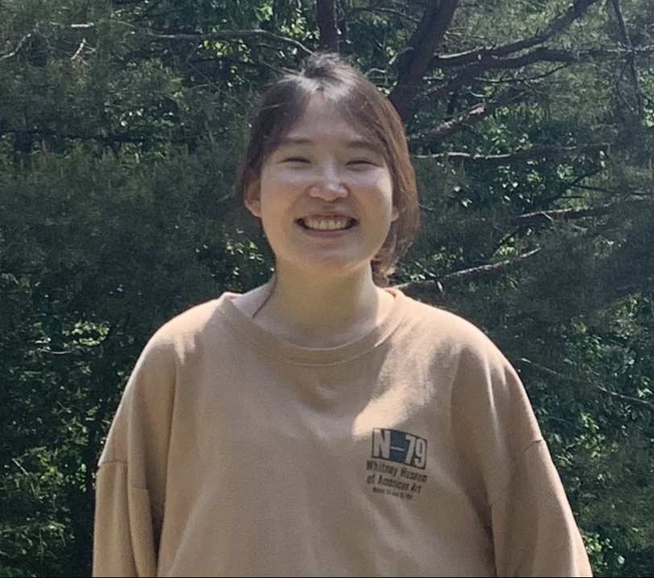

---
# Feel free to add content and custom Front Matter to this file.
# To modify the layout, see https://jekyllrb.com/docs/themes/#overriding-theme-defaults

layout: default
title: Jiin Woo
permalink: /
---

*{{ site.email }}* \\
Electrical and Computer Engineering Department, Carnegie Mellon University, Pittsburgh, PA, USA

<a href="https://github.com/{{ site.github_username }}"><i class="fab fa-github fa-2x"></i></a>
<a href="https://scholar.google.co.kr/citations?user=fwDL_gMAAAAJ"><i class="ai ai-google-scholar fa-2x"></i></a>

# Hi, I'm Jiin Woo

I am a PhD student in [Electrical and Computer Engineering](https://www.ece.cmu.edu/) department at [Carnegie Mellon University (CMU)](https://www.cmu.edu/). I am advised by [Yuejie Chi](https://users.ece.cmu.edu/~yuejiec/) and [Gauri Joshi](https://www.andrew.cmu.edu/user/gaurij/). Before coming to CMU, I received an M.S. in Electrical Engineering (advised by [Yung Yi](https://yung-web.github.io/home/)) and a B.S. in Mathematical Sciences in [Korea Advanced Institute of Science and Technology (KAIST)](https://www.kaist.ac.kr/en/). 

My reserach interests lie in the theoretical foundations in reinforcement learning, distributed machine learning, and statistical inference.

Email: jiinw [at] andrew [dot] cmu [dot] edu \\
[LinkedIn](https://www.linkedin.com/in/jiin-woo-73aa59189)/[Google Scholar](https://scholar.google.com/citations?user=fwDL_gMAAAAJ)

---

### Publications
(C: Conference, J: Journal)

[C3] Iterative Learning of Graph Connectivity from Partially‑Observed Cascade Samples \\
<strong><u>Jiin Woo</u></strong>, Jungseul Ok, Yung Yi \\
*ACM MobiHoc*, 2020 \\
[[paper](https://dl.acm.org/doi/abs/10.1145/3397166.3409130)]

[J2]  Information Source Finding in Networks: Querying With Budgets \\
Jaeyoung Choi, Sangwoo Moon, <strong><u>Jiin Woo</u></strong>, KyungHwan Son, Jinwoo Shin, Yung Yi \\
*IEEE/ACM Transactions on Networking*, 2020 \\
[[paper](https://arxiv.org/pdf/2009.00795.pdf)]

[C2]  On the Asymptotic Content Routing Stretch in Network of Caches: Impact of Popularity Learning \\
Boram Jin, <strong><u>Jiin Woo</u></strong>, Yung Yi \\
*NETGCOOP*, 2019 \\
[[paper](http://lanada.kaist.ac.kr/Publication/Conference/On_the_asymptotic.pdf)]

[J1] Estimating the Information Source under Decaying Diffusion Rates \\
<strong><u>Jiin Woo</u></strong>, Jaeyoung Choi \\
*Electronics*, 2019 \\
[[paper](https://www.mdpi.com/2079-9292/8/12/1384)]

[C1]  Rumor Source Detection under Querying with Untruthful Answers \\
Jaeyoung Choi, Sangwoo Moon, <strong><u>Jiin Woo</u></strong>, KyungHwan Son, Jinwoo Shin, Yung Yi \\
*IEEE INFOCOM*, 2017 \\
[[paper](https://arxiv.org/pdf/1711.05496.pdf)]

---

### Education
<strong>Carnegie Mellon University (CMU)</strong>, Pittsburgh, PA, USA, Aug 2021 - Present \\
Ph.D. in Electrical and Computer Engineering (advisors: [Yuejie Chi](https://users.ece.cmu.edu/~yuejiec/) and [Gauri Joshi](https://www.andrew.cmu.edu/user/gaurij/))

<strong>Korea Advanced Institute of Science and Technology (KAIST)</strong>, Daejeon, Korea, Aug 2016 - Aug 2018 \\
M.S. in Electrical Engineering (advisor: [Yung Yi](https://yung-web.github.io/home/))

<strong>Korea Advanced Institute of Science and Technology (KAIST)</strong>, Daejeon, Korea, Feb 2011 - Aug 2016 \\
B.S. in Mathematical Sciences

---

### Work Experience
<strong>[NAVER Corp.](https://www.navercorp.com/en/naver/company)</strong>, Seongnam, Korea, Sep 2018 - Aug 2021 \\
Machine Learning Engineer

---

### Awards & Scholarships
- KAIST Support Scholarship (2016-2018)
- Excellence Award in Creative Challenge Type SW R&D Program (2015)
- 3rd place in “Show Me The Street” Innovation Challenge (2015)
- The National Scholarship for Science and Engineering (2011-2015)
